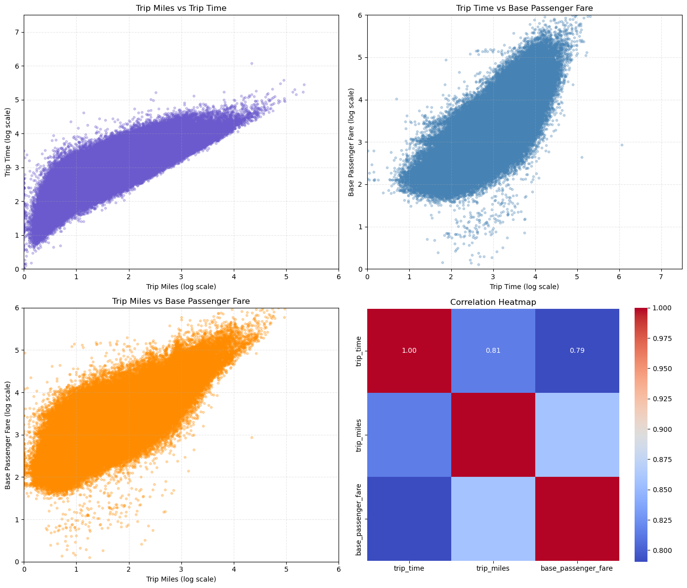
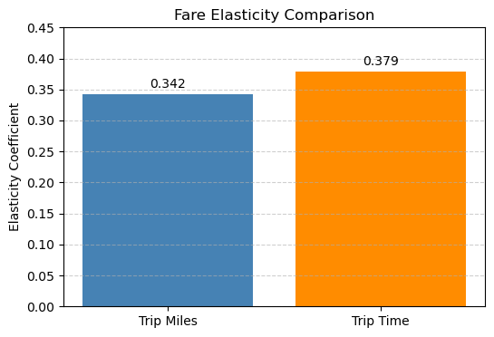
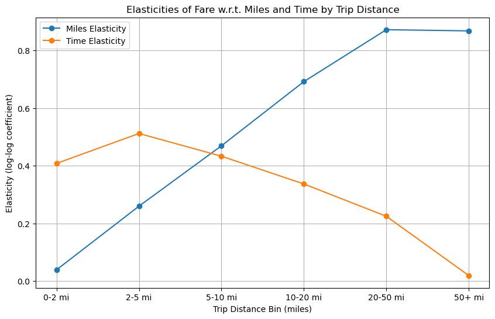

# 🚖 NYC Fare Elasticity — *Fair Fares through Data Science*  
*An explanatory analysis of how distance and time shape NYC’s For-Hire Vehicle (FHV) fares.*

---

## 🌆 Slide 1 · The Urban Fare Puzzle
Every month, NYC’s for-hire vehicles complete millions of trips.  
Yet passengers, drivers, and regulators still ask the same question:

> **“What truly drives the fare?”**

Unpredictable pricing erodes trust.  
Transparent data-driven evidence can guide smarter policy, fairer fares, and sustainable driver income.

---

## 💡 Slide 2 · Our Vision
We set out to decode the economic logic behind NYC’s trip fares —  
not to predict prices, but to **understand their behavior**.

### Research Goals
- Quantify the roles of **distance** and **time** in determining base fare.  
- Detect **non-linear patterns** — do long trips behave differently?  
- Build a **transparent, reproducible framework** on Microsoft Fabric.

> *The outcome: actionable insight for both city policy and private operators.*

---

## 🧠 Slide 3 · How We Approached It
Built entirely on **Microsoft Fabric trial capacity**, leveraging:

- **OneLake** for unified data storage  
- **Delta Lake** for versioned, consistent datasets  
- **Fabric Notebooks** for reproducible analytics  
- **Data Pipelines** for scheduled refreshes and automation  

We analyzed Jan 2025 FHV data (~20 million trips), focusing on:
`trip_miles`, `trip_time`, and `base_passenger_fare`.

---

## 📊 Slide 4 · What the Data Revealed
**1️⃣ Distance dominates fare changes.**  
Fares rise primarily with trip miles, not trip time.

**2️⃣ Long trips behave differently.**  
Beyond ~5 miles, fares increase faster per mile —  
a natural *tiered pricing pattern* built into the market.

**3️⃣ Time adds value, but steadily.**  
Each extra minute contributes modestly to fare —  
reflecting congestion and wait costs rather than distance effort.

> *The data tells a clear story: riders pay mainly for distance;  
time simply fine-tunes fairness.*

---

## 💰 Slide 5 · Translating Data into Business Value
| Stakeholder | Value Proposition |
|--------------|------------------|
| **Regulators** | Evidence-based policy; detect pricing asymmetries |
| **Operators** | Optimize fare structures; align driver pay with effort |
| **Investors** | Quantifiable metrics of demand elasticity |
| **Riders** | Transparency and trust in pricing logic |

### Key Figures
- **20.4 M** trips analyzed  
- **+$2.32 per mile** marginal gain  
- **~0.7 distance elasticity** vs **0.24 time elasticity**  
- **42 % stronger fare sensitivity** beyond 5 mi  

> *Every extra mile beyond 5 mi increases fare responsiveness by 42 %.*

---

## 📈 Slide 6 · Visual Insights
**Elasticity Summary**

**Segmented Fare Behavior**

*Short trips* → time in traffic dominates
*Long trips* → distance effect accelerates; time flattens.  

> *Data confirms a two-tier structure — simple, explainable, and fair.*

---

## 🧭 Slide 7 · Strategic Implications
### For Policymakers
- Supports **distance-anchored pricing** frameworks  
- Detects potential **under/over-charging** across trip bands  
- Guides **congestion mitigation** policy through time-based moderation  

### For Operators
- Reinforces current **per-mile incentive models**  
- Enables **data-backed fare adjustments** in new zones or times  

### For Investors
- Reveals **elastic market segments** where price moves affect demand  
- Establishes **transparent metrics** for valuation of mobility platforms  

---

## Slide 8: Power BI Reports Overview

### 📊 Interactive Dashboards

Power BI dashboards were built to explore and visualize the NYC hvFHV trip data and surge pricing experiments. Key features include:

- **EDA**
  - Histograms and Boxplots for Distributions
  - Correlations Heatmap
  - Bivariate Scatterplots
  - Average Fares with drilldown to Weeks and Calendar days.
  - Descriptive Stats that interact with other visuals

- **Elasticities by Distance Bins**
  - Average fares by weeks / calendar days 
  - Segmented view of distance bins, basic stats and Fare driver (time/distance)
  - Plot of Elasticies of Distance and Time with respect to distance bins

### 📸 Sample Visuals

  

> These dashboards allow stakeholders to interactively explore the experiment results, segment-level outcomes, and revenue insights, supporting data-driven decision-making.

---

## ⚙️ Slide 9 · Why Microsoft Fabric Matters
A reproducible, enterprise-grade setup:

- **Scalable:** handles tens of millions of rows natively  
- **Unified:** OneLake connects data, pipelines, and analytics seamlessly  
- **Trusted:** Delta format ensures consistent results across runs  
- **Repeatable:** easy migration from trial to production workspace  

> *This isn’t a one-off notebook — it’s a data product blueprint.*

---

## 🚀 Slide 10 · The Road Ahead
1. **Expand the scope** — analyze monthly data and borough-level elasticity.  
2. **Incorporate new features** — driver pay, surge multipliers, traffic metrics.  
3. **Automate via Fabric pipelines** — elasticity dashboards updated monthly.  
4. **Collaborate** — invite policymakers, data scientists, and startups to contribute.  

> *From data to dialogue — building the foundation for transparent urban mobility.*

---

## 🏁 Slide 11 · Closing Message
> **Distance drives value.**  
> **Transparency drives trust.**  
> **Data drives fairness.**

This study bridges analytics and policy, proving that open data and modern infrastructure can decode complex urban pricing systems.

---

## 📘 License & Credits
**License:** MIT  
**Author:** Anil [`github.com/<yourusername>`](https://github.com/<yourusername>)  
**Platform:** Microsoft Fabric (OneLake · Delta · Notebooks · Pipelines)  
**Visuals:** placeholders in `../images/` (replace after reruns)  
**Dataset:** NYC TLC FHV Trips — June 2025  

---

> *Rendered automatically via GitHub Pages — for investors, policymakers, and analysts who believe in fairer fares through open data.*
