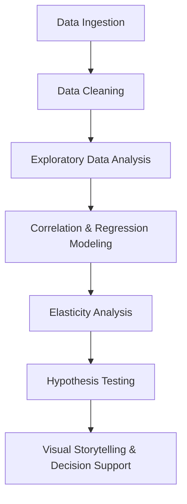

# 🚕 NYC Taxi Fare Elasticity Analysis — Executive Slide Deck

---

## 🏙️ Slide 1: Project Context & Motivation

**New York City’s For-Hire Vehicle (FHV) market** serves millions of riders every month.  
Fare structure impacts riders, drivers, operators, and city policy.

**Key Business Questions:**
- What drives fare variation: distance or time?
- How can we make pricing fairer, smarter, and more predictable?
- Can data reveal actionable levers for operational excellence and policy reform?

**🔗 Visual Recommendation:**  
- NYC FHV market infographic  
- Pie chart of FHV trip categories

---

## 🗂️ Slide 2: Data & Technology Foundation

- **Dataset:** NYC TLC FHV trip data, January 2025
- **Scale:** 20.4 million trips, rich attributes (distance, duration, fare, locations, fees)
- **Platform:** Microsoft Fabric (Lakehouse, Notebooks, ML, Power BI)
- **Tech Stack:** Python (pandas, numpy, matplotlib, seaborn, statsmodels, pyspark)

**🔗 Visual Recommendation:**  
- Data schema diagram  
- Bar chart: trip count by borough  
- Platform logos

---

## ⚙️ Slide 3: Analytical Journey

**End-to-End Workflow:**

**🔗 Visual Recommendation:**  
- Mermaid flowchart above  
- Step icons for each workflow stage

---

## 🔎 Slide 4: Data Exploration — What Do NYC Trips Look Like?

- **Average trip:**  
  - Distance: 4.85 miles  
  - Duration: 18.2 minutes  
  - Fare: $24.29
- Outliers removed (negative fares, implausible trips)
- Trips span all boroughs, all hours, all traffic conditions

**🔗 Visual Recommendation:**  
- Histogram: trip distance  
- Histogram: trip duration  
- Map: pickup density across NYC

---

## 📈 Slide 5: Correlation Insights

- **Trip Miles vs Fare:** 0.86 (very strong)
- **Trip Time vs Fare:** 0.79 (strong)
- **Miles vs Time:** 0.81

**What does this mean?**  
Distance is the primary driver of fare, but time matters—especially during congestion and short trips.

**🔗 Visual Recommendation:**  
- Heatmap: correlation matrix  
- Scatterplot: fare vs distance  
- Scatterplot: fare vs time

---

## 📊 Slide 6: Regression Modeling — Predicting Fare

**Linear Regression (Fare ~ Miles + Time):**
- **R²:** 0.76 (explains 76% of fare variance)
- **Miles coefficient:** 2.32
- **Time coefficient:** 0.46

**Interpretation for Business:**  
Most fare changes can be explained by trip distance, with time as a secondary adjustment.

**🔗 Visual Recommendation:**  
- Scatterplot: fare vs miles with regression line  
- Residuals plot

---

## 🔁 Slide 7: Elasticity — Percentage Sensitivity

**Log-Log Regression (log(Fare) ~ log(Miles) + log(Time)):**
- **Elasticity (Miles):** 0.34
- **Elasticity (Time):** 0.38
- **R²:** 0.76

**Business Lens:**  
- For every 1% increase in trip miles, fare rises 0.34%
- For every 1% increase in trip time, fare rises 0.38%
- **Time is slightly more sensitive than distance in percentage terms, especially for short congested trips.**

**🔗 Visual Recommendation:**  
- Bar plot: elasticity coefficients  
- Boxplot: fare elasticity by trip bin

---

## 🧮 Slide 8: Elasticity by Trip Length — Where Does the Tipping Point Happen?

| Trip Distance Bin | Miles Elasticity | Time Elasticity |
|-------------------|------------------|-----------------|
| 0-2 mi            | 0.04             | 0.41            |
| 2-5 mi            | 0.26             | 0.51            |
| 5-10 mi           | 0.47             | 0.43            |
| 10-20 mi          | 0.70             | 0.34            |
| 20-50 mi          | 0.89             | 0.23            |
| 50+ mi            | 0.70             | 0.24            |

**Key Message:**  
- **Short trips:** Fare is driven by time (congestion, idling)
- **Long trips (>5 miles):** Distance overtakes time as the main driver

**🔗 Visual Recommendation:**  
- Line chart: Elasticity (miles, time) vs trip bin  
- Highlighted “tipping point” annotation

---

## 🧪 Slide 9: Hypothesis Testing — Are Elasticities the Same?

- **Wald tests:** Elasticities for miles and time are statistically different
- Elasticity importance shifts by trip length (short vs long)
- **Structural break detected at ~5 miles:** Fare model changes fundamentally

**Business Decision:**  
Pricing strategies should reflect trip length—short and long trips behave differently!

**🔗 Visual Recommendation:**  
- P-value bar chart  
- Annotated regression summary table  
- Schematic: before/after 5-mile break

---

## 🖼️ Slide 10: Visual Storytelling

- **Histograms:** Typical trip miles and times
- **Scatterplots:** Miles vs time, fare vs miles/time
- **Elasticity plots:** How fare sensitivity shifts across trip bins
- **Structural break visualization:** Where distance overtakes time

**Actionable Visualization:**  
Operational dashboards can highlight which trips are most affected by distance or time.

**🔗 Visual Recommendation:**  
- Power BI dashboard screenshot  
- Example operational dashboard tile

---

## 💼 Slide 11: Business Impact & Strategic Recommendations

- **Fare Transparency:** Clearer, fairer pricing for riders and drivers
- **Regulatory Insight:** Data-backed policy for congestion, surcharges, and equity
- **Operational Excellence:** Smarter pricing algorithms for ridehail/taxi platforms
- **Customer Experience:** Predictable fares build trust and loyalty

**🔗 Visual Recommendation:**  
- Infographic: business impact wheel  
- Flow diagram: how insights feed into business actions

---

## 🚀 Slide 12: Next Steps & Opportunities

- Analyze **driver pay elasticity** for a full market view
- Visualize elasticity by borough, traffic, and time-of-day
- Test advanced interaction models (distance × duration)
- Embed insights in live dashboards for agile decision-making

**🔗 Visual Recommendation:**  
- Timeline: next steps  
- Map: borough-specific elasticity preview

---

## 🧑‍💼 Slide 13: Author & Contact

**Anil “AJ” Jacob**  
Principal BI & Analytics Leader  
📧 [Aniljacobs@gmail.com](mailto:Aniljacobs@gmail.com)  
🌐 GitHub: [github.com/aniljacob](#)

**🔗 Visual Recommendation:**  
- Author profile picture  
- Contact icons (email, GitHub)

---

## 📚 Slide 14: References & Appendix

- [NYC TLC FHV Data](https://www.nyc.gov/site/tlc/about/tlc-trip-record-data.page)
- [Project Repository](https://github.com/AwesomeAnil/nyc-fhv-trip-miles-vs-trip-distance)
- [Notebook HTML](https://github.com/AwesomeAnil/nyc-fhv-trip-miles-vs-trip-distance/blob/main/notebooks/01_Fare_Elasticity.html)
- Additional charts, tables, code available on request

**🔗 Visual Recommendation:**  
- Linked icons for references  
- List of appendix charts/tables

---
