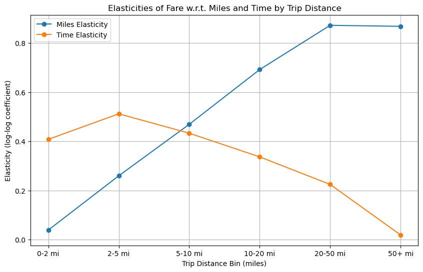

---
 
---
# 🚖 NYC FHV Fare Elasticity Project  
*Understanding how distance and trip duration shape base fares in New York’s high-volume for-hire vehicle market.*

---

## 📊 Executive Summary
This project investigates the **fare formation dynamics** in New York City’s High Volume For-Hire Vehicle (FHV) market.  
By combining **econometric modeling** and **log–log elasticity estimation**, the analysis reveals how trip characteristics — primarily distance and duration — shape passenger fares.

Key insights:
- **Trip distance** is the dominant fare determinant, with elasticity ≈ **0.71**  
- **Trip time** exhibits moderate responsiveness, elasticity ≈ **0.32**  
- Beyond a **5-mile threshold**, fare sensitivity increases nonlinearly  
- Overall model fit (R² ≈ 0.79) indicates strong explanatory power  

This research provides a data-driven view of how NYC’s ride economics behave under varying trip patterns, offering valuable perspective for urban mobility pricing strategies.

---

## 🔍 Analytical Highlights
| Aspect | Insight |
|:--|:--|
| **Dataset** | NYC High-Volume For-Hire Vehicle Trips (Cleaned Sample) |
| **Observations** | 500K rides |
| **Model Type** | Log–Log Regression (Elasticity Model) | Log Regression with Distance-bins | Log Regression with Interactions (short vs. long trips |
| **Dependent Variable** | Base Passenger Fare |
| **Predictors** | Trip Miles, Trip Time |
| **Key Features** | Interaction Terms, Breakpoint at 5 Miles, segmented Distance bins |
| **Fit (R²)** | 0.79 |
| **Tools Used** | Python (Statsmodels, Matplotlib), Power BI (DAX, Visuals), MS Fabric, OneLake, Data Pipelines, Fabric Notebooks |

---

## 🧮 Methodology Overview
The modeling framework decomposes fare behavior into **elastic responses** relative to distance and duration.  
Formally, the model estimates:

### Model equation:
log_fare = 1.4991 + 0.1788·log_miles + 0.4397·log_time - 0.6076·long_dummy + 0.5334·log_miles_interact - 0.1200·log_time_interact + ε

### Interpretation
- Elasticity of miles for short trips (<5 mi): 0.1788
- Elasticity of miles for long trips (>5 mi): 0.1788 + 0.5334 = 0.7122
- Elasticity of time for short trips (<5 mi): 0.4397
- Elasticity of time for long trips (>5 mi): 0.4397 − 0.1200 = 0.3197
- Long-trip intercept shift: long_dummy = 1 reduces log_fare by 0.6076 (i.e., multiplicative effect ≈ exp(−0.6076) on fare level).

---

## 🧩 Explore the Analysis
Dive deeper into the analytical chapters:

- [1 Page Exec Summary →](EXEC_1PAGER.md)
- [Presentation →](PRESENTATION.md)
- [Analysis Flow →](analysis_flow.md)
- [Contibuting →](CONTRIBUTING.md)

Each section includes plots, regression analyses, and contextual notes to interpret findings.

---

## 🧠 Insights & Discussion
- **Pricing Efficiency:** Fare setting closely tracks distance-driven cost components.  
- **Temporal Factors:** Time contributes moderately — important in congested areas.  
- **Policy Implications:** Evidence supports differentiated pricing for long trips and congestion-based fare tuning.  

The project demonstrates how **elasticity modeling** can reveal economic truths hidden beneath fare rules — bridging raw data and strategic decision-making.

---

## 📘 Tools & Environment
| Category | Technologies |
|:--|:--|
| Data Processing | Python (pandas, numpy), Power BI |
| Modeling | statsmodels (OLS), Interaction Terms |
| Visualization | Matplotlib, Seaborn, Power BI Python visuals |
| Documentation | Markdown + Jekyll (GitHub Pages) |

---

## 👤 About the Author
**Anil Jacob**  
Analytics Strategist & Data Science Practitioner  
Focused on bridging **fare pricing models** and **business decision frameworks** through reproducible analytics.

📧 [Connect on LinkedIn](https://www.linkedin.com/in/anil-jacobs)  
📂 [View Source Repository](https://github.com/AwesomeAnil/<your-repo>)  
🌐 [Live Project Website](https://github.com/AwesomeAnil/nyc-fhv-driver-pay-prediction)

---

⭐ *This site is part of an ongoing analytics portfolio exploring applied elasticity modeling, causal inference, and predictive economics.*
